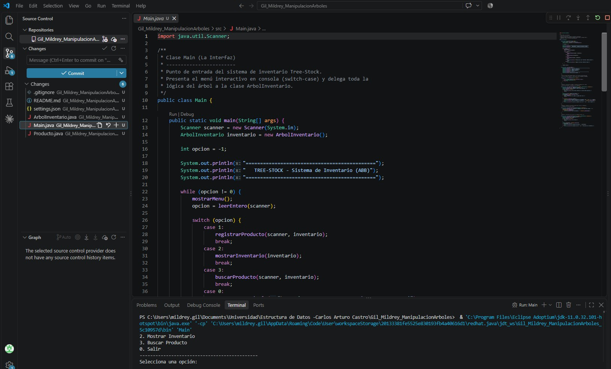
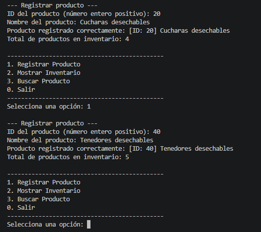
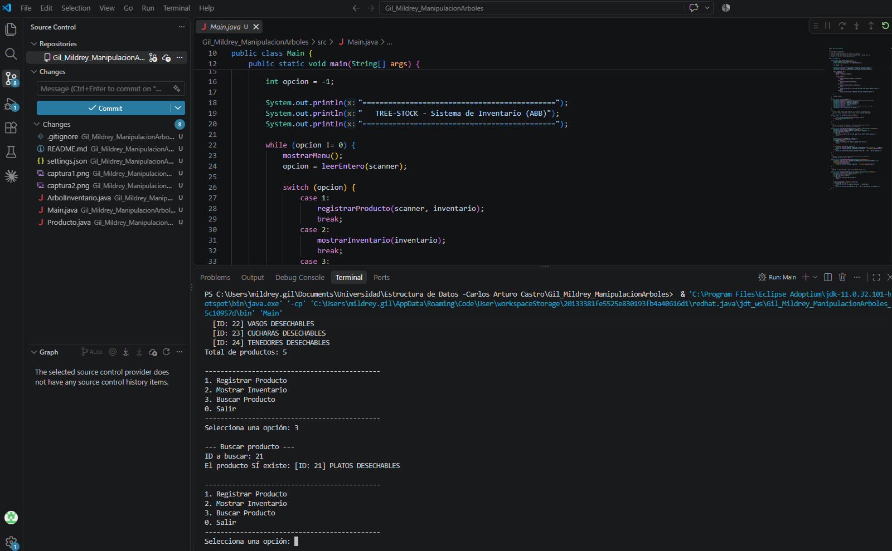
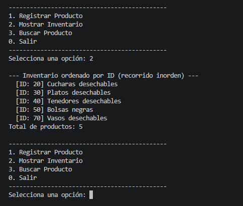
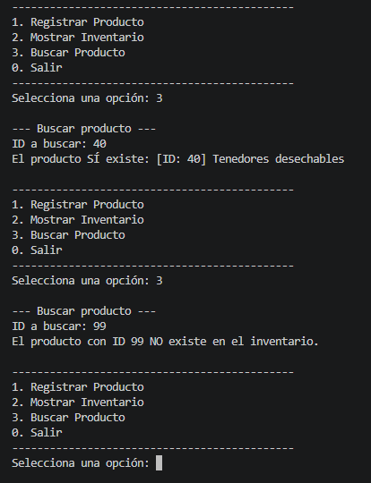

# Tree-Stock — Sistema de Inventario con Árbol Binario de Búsqueda

## 1. Objetivo

Aplicación de consola en Java que gestiona el inventario de productos de
**Tree-Stock** mediante un **Árbol Binario de Búsqueda (ABB)** implementado
manualmente con nodos y punteros. El proyecto demuestra la comprensión de la
estructura lógica de un árbol binario de búsqueda y su aplicación en un
sistema de clasificación e inventario.

### ¿Qué es un árbol binario de búsqueda y cómo se aplica aquí?

Un **árbol binario** es una estructura dinámica donde cada nodo puede tener
como máximo dos hijos: uno **izquierdo** y uno **derecho**. En un árbol
binario de **búsqueda** se cumple una regla: los valores menores que un nodo
se ubican a su izquierda y los mayores a su derecha.

En este proyecto cada nodo es un `Producto` y su **ID** es la clave de
ordenamiento. Al registrar un producto se parte desde la **raíz** y se compara
su ID con el de cada nodo: si es menor se baja por el puntero `izquierdo`, si
es mayor por el puntero `derecho`, hasta encontrar un puntero vacío (`null`)
donde se engancha el nuevo nodo. Gracias a esta organización, el recorrido
**inorden** (izquierda → raíz → derecha) lista el inventario ordenado por ID, y
la búsqueda descarta una rama completa en cada comparación.

**Ejemplo:** si se registran los IDs 50, 30, 70, 20 y 40 en ese orden, el árbol queda así:

```
            50 (Teclado)
           /            \
     30 (Mouse)      70 (Monitor)
      /       \
20 (Cable)  40 (Webcam)
```

Recorrido inorden: `20, 30, 40, 50, 70`

## 2. Arquitectura del proyecto

El proyecto está dividido estrictamente en **tres clases**:

| Clase                   | Responsabilidad                                                                 |
|-------------------------|---------------------------------------------------------------------------------|
| `Producto.java`         | **El Nodo:** datos (`int id`, `String nombre`) y punteros (`Producto izquierdo`, `Producto derecho`). |
| `ArbolInventario.java`  | **La Lógica:** puntero `raiz` y métodos `insertar()` (recursivo), `recorridoInorden()` y `buscar()` por ID. |
| `Main.java`             | **La Interfaz:** menú interactivo en consola con `switch-case`.                 |

## 3. Menú de la aplicación

```
1. Registrar Producto  -> solicita ID y nombre, lo inserta en el árbol (rechaza IDs repetidos)
2. Mostrar Inventario  -> ejecuta el recorrido inorden (lista ordenada por ID)
3. Buscar Producto     -> solicita un ID e indica si existe o no
0. Salir
```

## 4. Requisitos y ejecución

- **JDK:** Eclipse Temurin (o cualquier JDK 11+).
- **Entorno recomendado:** Visual Studio Code con el *Extension Pack for Java*.

### Compilar y ejecutar desde terminal

```bash
cd src
javac -encoding UTF-8 *.java -d ../bin
cd ../bin
java Main
```

### Ejecutar desde VS Code

1. Abrir la carpeta del proyecto en VS Code.
2. Abrir `src/Main.java`.
3. Presionar el botón **Run** (▶) que aparece sobre el método `main`.

## 5. Capturas de pantalla de la consola

### Menú principal


### Inserción de productos


### Validación de ID repetido


### Inventario ordenado (recorrido inorden)


### Búsqueda de productos


## 6. Video de sustentación

[Ver video](https://www.youtube.com/watch?v=y-W5p-wG5QU)

## 7. Autores

- MILDREY GIL SANMARTIN.

## 8. Control de versiones

Este repositorio refleja al menos 5 commits, evidenciando el
avance incremental del desarrollo (nodo `Producto`, lógica del árbol, menú
interactivo y documentación).
